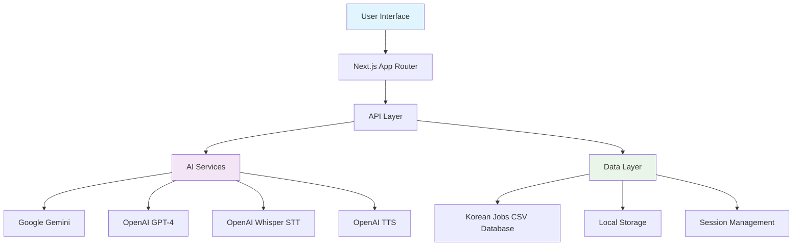
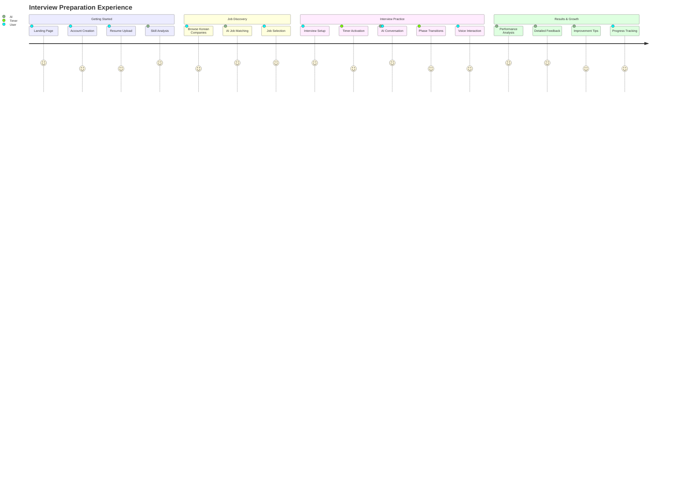

# 🎯 IpsaGo - AI-Powered Interview Platform for Korean Job Market

<div align="center">
  
  
  > **IpsaGo** is an intelligent interview preparation platform designed specifically for foreigners entering the Korean job market. Practice real interviews with AI, get personalized feedback, and boost your confidence!

  [](https://nextjs.org/)
  [](https://www.typescriptlang.org/)
  [](https://tailwindcss.com/)
  [](https://ai.google.dev/)
  
  🌐 **[Live Demo](https://your-website-link.com)** | 📚 [Documentation](#quick-start) | 
</div>

## 📸 Platform Overview

### 🚀 How IpsaGo Works


*Complete interview preparation journey: User onboarding → Resume upload → Job matching → AI practice interviews*

### 🤖 AI Interview Interface


*Real-time AI conversation with intelligent questioning, 20-minute timer, and phase management*

## ✨ Key Features

### 🤖 **Advanced AI Interview Simulation**
- **Real-time conversations** powered by Google Gemini & OpenAI GPT-4
- **Multi-phase interviews**: Introduction → Technical → Behavioral → Closing
- **Voice & text support** with Speech-to-Text and Text-to-Speech
- **Dynamic question generation** based on specific job requirements

### ⏱️ **Smart Time Management** *(New Feature)*
- **20-minute interview timer** with visual countdown
- **Phase-based tracking** and automatic transitions
- **Visual warnings** for time management (5min yellow, 1min red alert)
- **Pause/restart functionality** for flexible practice

### 🎨 **Intelligent User Experience**
- **Personalized onboarding** with AI-powered resume analysis
- **Job matching algorithm** for Korean companies (500+ listings)
- **Real-time feedback** and performance analytics
- **Responsive design** with beautiful Aurora animations

### 🔧 **Technical Excellence**
- **Next.js 14** with App Router and TypeScript
- **OpenAI Whisper** for speech recognition
- **Real-time audio processing** and TTS synthesis
- **CSV-based job database** with Korean market focus

## 🚀 Quick Start

### Prerequisites
- Node.js 18+ 
- npm or yarn
- Gemini API key (free tier available)
- OpenAI API key (optional)

### Installation

1. **Clone the repository**
   ```bash
   git clone https://github.com/USERNAME/ipsago-fe.git
   cd ipsago-fe
   ```

2. **Install dependencies**
   ```bash
   npm install --legacy-peer-deps
   ```

3. **Environment setup**
   ```bash
   cp .env.example .env.local
   ```
   
   Add your API keys to `.env.local`:
   ```env
   GEMINI_API_KEY=your_gemini_api_key_here
   OPENAI_API_KEY=your_openai_api_key_here
   NEXT_PUBLIC_GEMINI_API_KEY=your_gemini_api_key_here
   ```

4. **Run development server**
   ```bash
   npm run dev
   ```

5. **Open your browser**
   ```
   http://localhost:3000
   ```

## 🏗️ Architecture Overview



## 📁 Project Structure

```
ipsago-fe/
├── app/                    # Next.js App Router
│   ├── api/               # Backend API routes
│   │   ├── interview/     # Interview chat endpoints
│   │   ├── stt/          # Speech-to-text API
│   │   └── tts/          # Text-to-speech API
│   ├── dashboard/         # Job listings page
│   ├── interview/[id]/    # Dynamic interview pages
│   ├── onboarding/        # User registration flow
│   └── feedback/[id]/     # Interview feedback pages
├── components/            # React components
│   ├── ui/               # Reusable UI components (shadcn/ui)
│   ├── interview-interface.tsx  # Main interview component
│   ├── interview-timer.tsx      # NEW: Timer with phase management
│   ├── onboarding-flow.tsx     # User registration
│   ├── feedback-dashboard.tsx  # Analytics display
│   └── Aurora.tsx             # WebGL background animation
├── lib/                  # Utility functions & integrations
│   ├── gemini.ts         # Google Gemini AI integration
│   ├── jobs-data.ts      # Korean job database (500+ companies)
│   ├── recordAudio.ts    # Audio recording utilities
│   └── utils.ts          # Helper functions
├── public/               # Static assets
│   └── assets/          # Screenshots & demo videos
└── data/                # CSV job data & Korean companies
```

## 🛠️ Tech Stack

<div align="center">

| Category | Technology | Purpose |
|----------|------------|---------|
| **Frontend** | Next.js 14, TypeScript, Tailwind CSS | Modern React framework with type safety |
| **UI Library** | shadcn/ui, Radix UI, Lucide Icons | Professional component library |
| **AI Integration** | Google Gemini, OpenAI GPT-4, Whisper, TTS | Multi-provider AI capabilities |
| **Real-time Features** | WebAudio API, Speech Recognition | Voice interaction support |
| **Animation** | WebGL, CSS Animations, Framer Motion | Engaging visual experience |
| **Data Management** | CSV Database, LocalStorage, Session Storage | Efficient data handling |

</div>

## 🎯 User Journey & Flow



## 🌟 Recent Enhancements

### ⏱️ **Interview Timer System** *(Latest Addition)*
- **Visual countdown timer** with 30-minute duration
- **Smart color transitions**: Blue → Yellow → Red based on remaining time
- **Phase management**: Automatic tracking of interview progress
- **Pause/restart functionality** for practice flexibility
- **Time warnings**: Alert system for better time management

### 🔧 **Technical Improvements**
- **Enhanced error handling** with retry logic
- **Performance optimization** with response caching
- **Better API integration** with multiple AI providers
- **Improved responsive design** for mobile devices

## 🔧 Available Scripts

```bash
npm run dev          # 🚀 Start development server
npm run build        # 🏗️  Build for production  
npm run start        # ▶️  Run production build
npm run lint         # 🔍 Run ESLint
npm run type-check   # 📝 TypeScript checking
```

## 🌐 API Endpoints

| Endpoint | Method | Description | Demo Mode |
|----------|--------|-------------|-----------|
| `/api/jobs` | GET | Fetch Korean job listings from CSV | ✅ Available |
| `/api/interview/chat` | POST | AI-powered interview conversation | 🔑 Requires API key |
| `/api/stt` | POST | Speech-to-text conversion | 🔑 Requires API key |
| `/api/tts` | POST | Text-to-speech generation | 🔑 Requires API key |
| `/api/test-gemini` | GET | API key validation and testing | 🛠️ Development only |

## 🎨 UI/UX Features

- **📱 Fully Responsive** - Optimized for desktop, tablet, and mobile
- **🌙 Theme Support** - Dark/Light mode compatibility
- **✨ Aurora Animation** - Beautiful WebGL background effects
- **🎙️ Voice Visualization** - Real-time audio waveforms
- **📊 Progress Indicators** - Interview phase and time tracking
- **♿ Accessibility** - ARIA labels and keyboard navigation support

## 🤝 Contributing

We welcome contributions! Here's how to get started:

1. **Fork** the repository
2. **Create** your feature branch (`git checkout -b feature/AmazingFeature`)
3. **Commit** your changes (`git commit -m 'feat: Add some AmazingFeature'`)
4. **Push** to the branch (`git push origin feature/AmazingFeature`)
5. **Open** a Pull Request

### Development Guidelines
- Use TypeScript for all new files
- Follow the existing code style and ESLint rules
- Add unit tests for new components
- Update documentation for new features
- Test on multiple devices and browsers

## 📄 License

This project is licensed under the MIT License - see the [LICENSE](LICENSE) file for details.
 
<div align="center">
  <p><strong>Built with ❤️ for bridging international talent with Korean opportunities</strong></p>
  
</div>